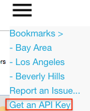

GeoTuple provides an API (HTTP GET/POST requests) for querying the database and return data in JSON format.

```
It is the goal of this project to add and improve the capabilities over time.
```

### API Endpoints
The following calls area available:

Method            |  Returns
------ |  -------
api_getthemes     | Available themes
------ |  -------

api_getthemeprops | Properties for the specified theme
--------- | -------
theme | Name of theme

api_getpoint      | Data values for the specified theme(s) 
--------- | -------
longitude | x
latitude  | y
theme1 .. n | Name of theme(s) 

api_getpoints     | Data values for the specified theme(s) within extent at zoom level 
--------- | -------
SW_longitude | xmin
SW_latitude | ymin
NE_longitude| xmax
NE_latitude | ymax
zoom | [zoom level](http://wiki.openstreetmap.org/wiki/Zoom_levels){:target="_blank"}
theme1 .. n | Name of theme(s)
API_KEY | Your API Key (see below)

_**Max 1000 points/request**_

Example: [Download from R](https://gist.github.com/rhansson/1efb9a1b9bec053aa19d71c67f0e27a3){:target="_blank"}


##### _**Get an API Key**_

1. Launch the [GeoTuple app](http://geotuple.com){:target="_blank"}
2. Select "Get an API Key" from the menu in the top right of the window
  

3. Copy the code displayed at the top left of the window
  

> _**Please limit your requests to < 5/min**_

#### Examples
Results are returned as a JSON array []. If invalid request or an error occurs an empty result is returned.
_Notice that curl is used for illustration only, any HTTP client will do._


```
# Available themes
curl -X POST http://geotuple.com/ocpu/user/rolandhhansson/library/geotuple/R/api_getthemes/json -H "Content-Type: application/json"
#
# returns:
[
  {
    "name": "landcov",
    "descr": "Land Cover"
  },
  {
    "name": "dist_mroad",
    "descr": "Distance from Major Roads"
  },
  {
    "name": "pop_dens",
    "descr": "Population Density"
  },
  {
    "name": "inc_percap",
    "descr": "Income per Capita"
  },
  {
    "name": "z",
    "descr": "Elevation"
  },
  {
    "name": "dist_starb",
    "descr": "Distance from Starbucks"
  }
  { ... }
]
```

```
# Properties for theme "z"
curl http://geotuple.com/ocpu/user/rolandhhansson/library/geotuple/R/api_getthemeprops/json \
 -H "Content-Type: application/json" \
 -d '{"theme":"z"}'
 #
 # returns:
 [
  {
    "descr": "Elevation",
    "type": "discrete",
    "units": "meters",
    "is_dist": false,
    "min": -58,
    "max": 3432,
    "avg": 610.386
  }
]
```

```
# Data for theme "z" near location
# "dist" is the distance to the database point (returned) closest to the specified location
curl http://geotuple.com/ocpu/user/rolandhhansson/library/geotuple/R/api_getpoint/json \
 -H "Content-Type: application/json" \
 -d '{"lon":"-121.494", "lat":"38.577", "themes":"z"}'
 #
 # returns:
 [
  {
    "dist": 103,
    "z": 25
  }
]
```

```
# Data for themes "calenviro" and "inc_percap" near location
# "dist" is the distance to the database point (returned) closest to the specified location
curl http://geotuple.com/ocpu/user/rolandhhansson/library/geotuple/R/api_getpoint/json \
 -H "Content-Type: application/json" \
 -d '{"lon":"-121.494", "lat":"38.577", "themes":["calenviro", "inc_percap"]}'
 #
 # returns:
 [
  {
    "dist": 103,
    "calenviro": 51,
    "inc_percap": 30019
  }
]

```

```
# Data for all themes near location
# "dist" is the distance to the database point (returned) closest to the specified location
curl http://geotuple.com/ocpu/user/rolandhhansson/library/geotuple/R/api_getpoint/json \
 -H "Content-Type: application/json" \
 -d '{"lon":"-121.494", "lat":"38.577", "themes":"*"}'
 #
 # returns:
 [
  {
    "dist": 103,
    "landcov": 23,
    "dist_mroad": 574,
    "pop_dens": 841,
    "inc_percap": 30019,
    "z": 25,
    "dist_starb": 342
    ...
  }
]
```

```
# Data for theme "z" within extent at zoom level 10
# Replace YOUR_API_KEY 
curl http://geotuple.com/ocpu/user/rolandhhansson/library/geotuple/R/api_getpoints/json \
-H "Content-Type: application/json" \
-d '{"sw_lon":"-121.552", "sw_lat":"38.543", "ne_lon":"-121.44", "ne_lat":"38.61", "zoom":"10", "themes":["landcov", "dist_mroad"], "key":"API_KEY"}'
 #
 # returns:
 [
  {
    "x": -121.5152,
    "y": 38.5698,
    "z": 7
  },
  {
    "x": -121.5147,
    "y": 38.6058,
    "z": 6
  },
  {
    "x": -121.4693,
    "y": 38.5698,
    "z": 10
  },
  {
    "x": -121.4688,
    "y": 38.6058,
    "z": 9
  }
]
```

```
# Data for themes "landcov" and "dist__mroad" within extent at zoom level 11
# Replace YOUR_API_KEY 
curl http://geotuple.com/ocpu/user/rolandhhansson/library/geotuple/R/api_getpoints/json \
-H "Content-Type: application/json" \
-d '{"sw_lon":"-121.552", "sw_lat":"38.543", "ne_lon":"-121.44", "ne_lat":"38.61", "zoom":"11", "themes":["landcov", "dist_mroad"], "key":"API_KEY"}'
 #
 # returns:
 [
  {
    "x": -121.5377,
    "y": 38.6058,
    "landcov": 23,
    "dist_mroad": 350
  },
  {
    "x": -121.5379,
    "y": 38.5878,
    "landcov": 23,
    "dist_mroad": 327
  },
  {
    "x": -121.492,
    "y": 38.5878,
    "landcov": 23,
    "dist_mroad": 976
  },
  { ... }
]
```

> YOU EXPRESSLY UNDERSTAND AND AGREE THAT YOUR USE OF THE SERVICE AND THE CONTENT IS AT YOUR SOLE RISK AND THAT THE SERVICE AND THE CONTENT ARE PROVIDED "AS IS" AND "AS AVAILABLE."

